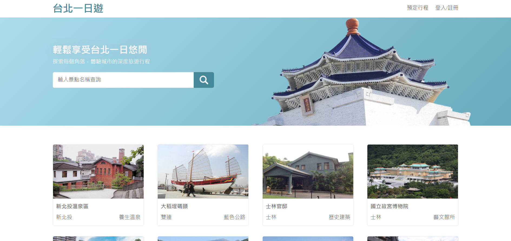

# [台北一日遊](https://travel.shauncc.site/)

---
## 專案主旨
本專案為旅遊訂購行程網站，讓使用者可以在此瀏覽台北各個景點以及下訂導覽行程
## 使用技術
* Frond-End  
HTML.CSS.JavaScript.RWD
* Back-End  
1. MVC架構  
2. Python 框架為 Flask  
3. RESTful API
* Database  
1. MySQL
2. 網站部分以 ORM(Flask-SQLAlchemy) 進行操作
* Cloud
1. 網站架設於 Google Cloud Platform
## 主要功能
* 景點瀏覽及下訂
